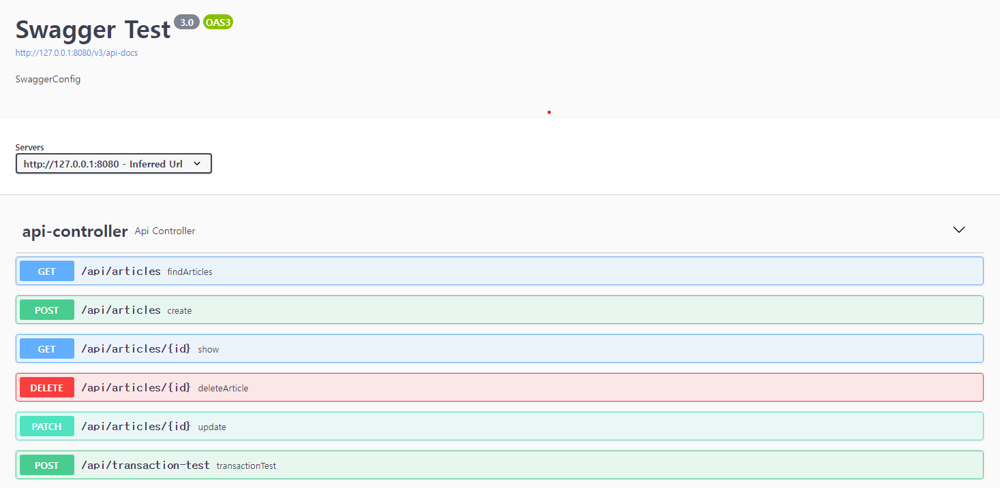

# Springboot Simple CRUD

## Usage

```
# docker image ㅂㅣㄹㄷㅡ
docker build -t app .

# docker 서버 실행
docker run -p 8000:8000 app
```

# API Endpoint

- Swagger
  - http://127.0.0.1:8000/swagger-ui/index.html


